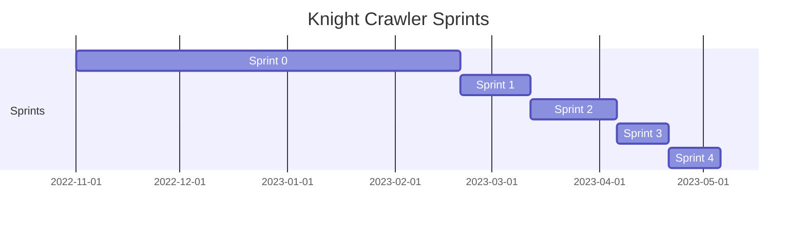
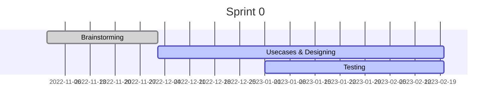
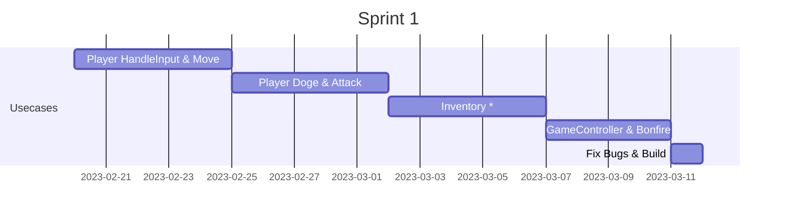
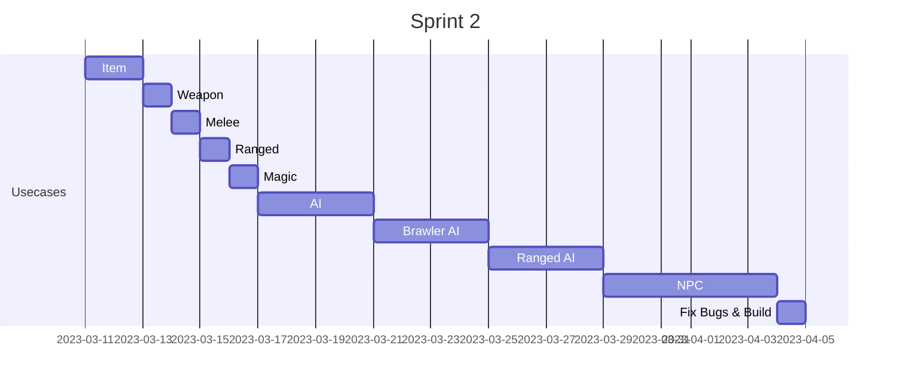
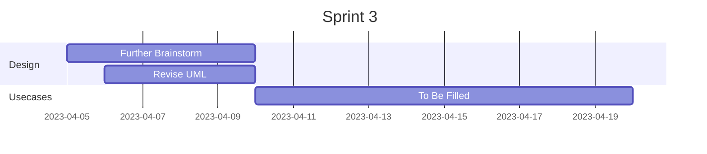
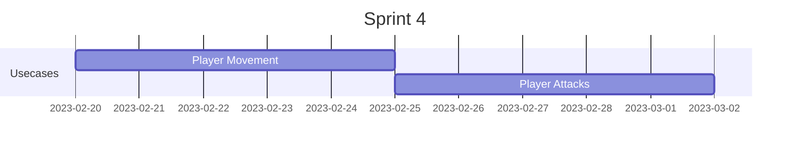

# Knight-Crawler
 The Crawler

```mermaid
gantt
    dateFormat  DD-MM-YYYY
    title       Knight Crawler Sprints

    section Sprints
    Sprint 0                    :           2022-11-01, 111d
    Sprint 1                    :           sp1, 2023-02-20, 20d
    Sprint 2                    :           sp2, after sp1, 25d
    Sprint 3                    :           sp3, after sp2, 15d
    Sprint 4                    :           sp4, after sp3, 15d    
```

```mermaid
gantt
    dateFormat DD-MM-YYYY
    title      Sprint 0
    %% 111 days in total

    Brainstorming               :done,      BSM, 2022-11-01, 31d
    Usecases & Designing        :active,    UCD, after BSM, 80d
    Testing                     :active,    2023-01-01, 50d
```

```mermaid
gantt
    dateFormat  DD-MM-YYYY
    title       Sprint 1
    %% 20 days in total

    section Usecases
    Player HandleInput & Move   :           PM, 2023-02-20, 5d
    Player Doge & Attack        :           PA, after PM, 5d
    Inventory *                 :           INV, after PA, 5d
    GameController & Bonfire    :           GCB, after INV, 4d
    Fix Bugs & Build            :           after GCB, 1d
```

```mermaid
gantt
    dateFormat  DD-MM-YYYY
    title       Sprint 2
    %% 25 days in total

    section Usecases
    Item                        :           IT, 2023-03-11, 2d
    Weapon                      :           WP, after IT, 1d
    Melee                       :           ML, after WP, 1d
    Ranged                      :           RN, after ML, 1d
    Magic                       :           MG, after RN, 1d
    AI                          :           AI, after MG, 4d
    Brawler AI                  :           BAI, after AI, 4d
    Ranged AI                   :           RAI, after BAI, 4d
    NPC                         :           NPC, after RAI, 6d
    Fix Bugs & Build            :           after NPC, 1d
```

```mermaid
gantt
    dateFormat  DD-MM-YYYY
    title       Sprint 3
    %% 15 days in total

    section Design
    Further Brainstorm          :           BS, 2023-04-05, 5d
    Revise UML                  :           UM, 2023-04-06, 4d
    section Usecases
    To Be Filled                :           2023-04-10, 10d
```

```mermaid
gantt
    dateFormat  DD-MM-YYYY
    title       Sprint 4
    %% 15 days in total

    section Usecases
    Player Movement             :           PM, 2023-02-20, 5d
    Player Attacks              :           PA, after PM, 5d
```